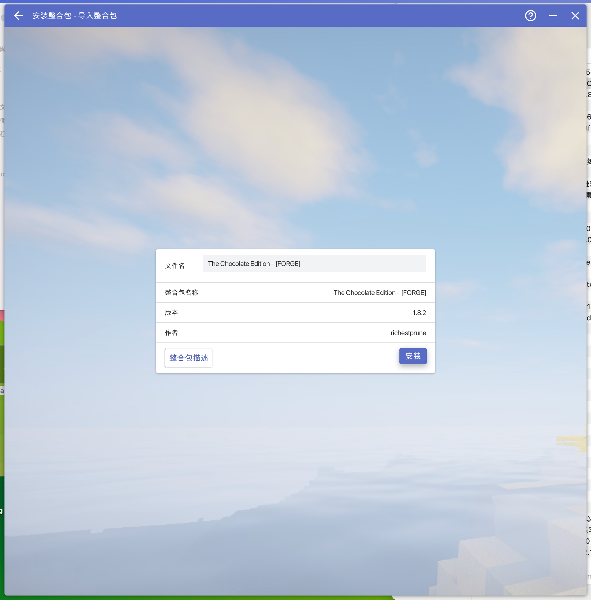
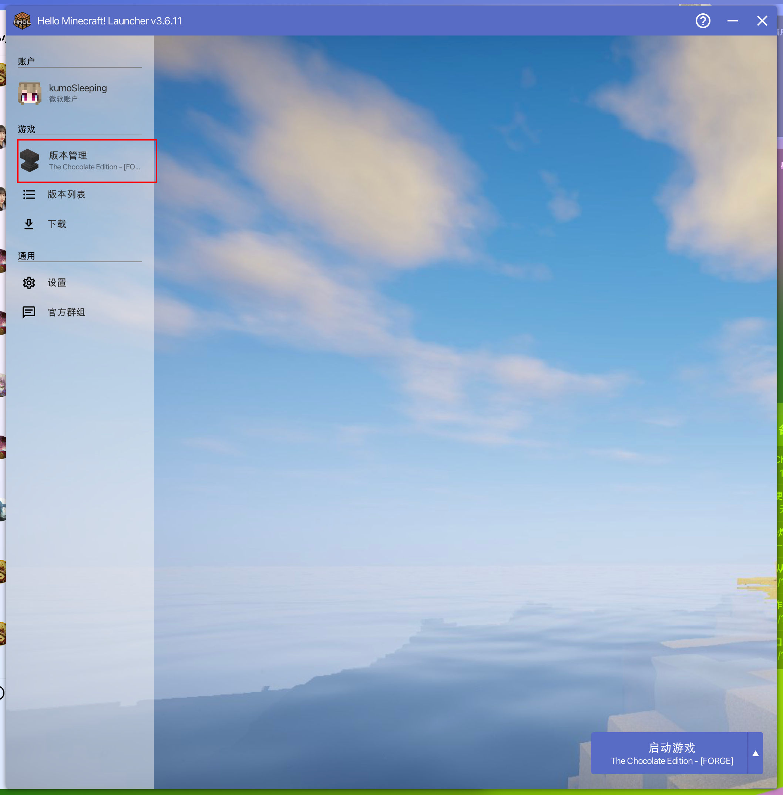
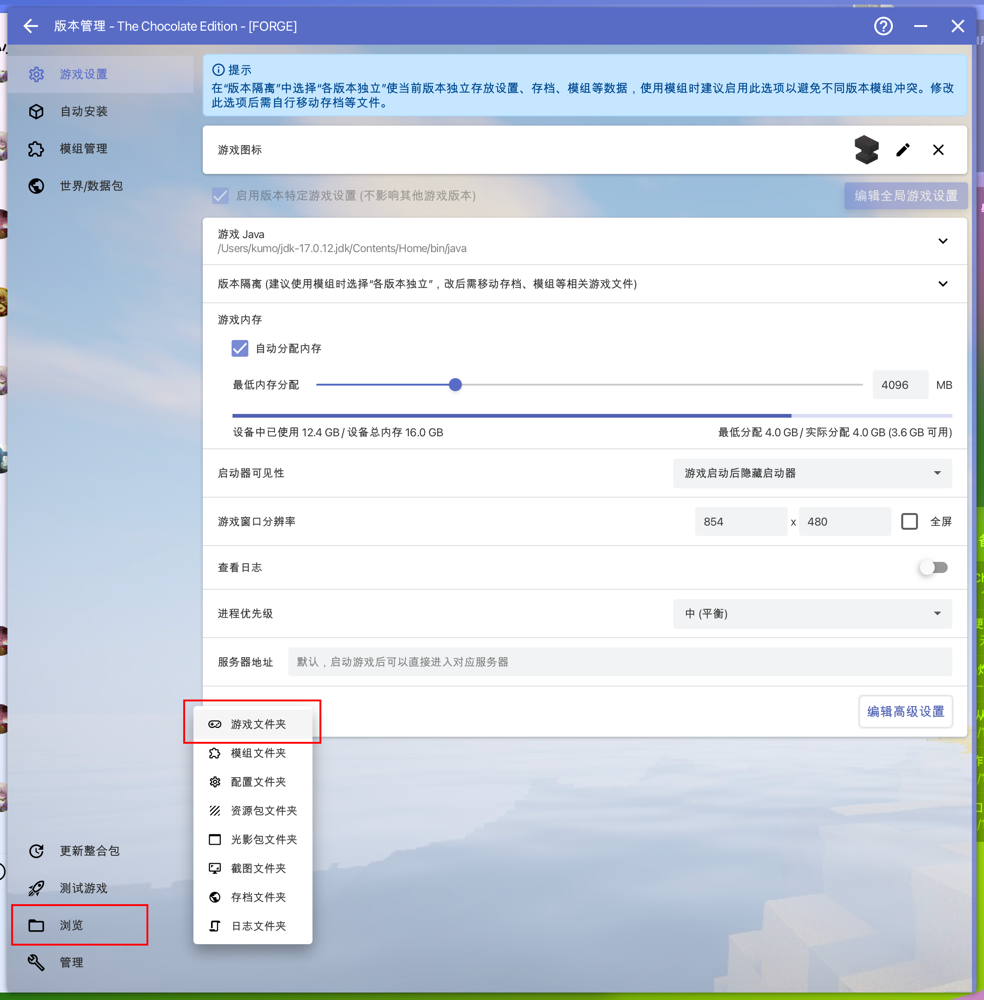
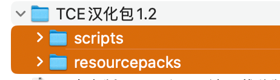
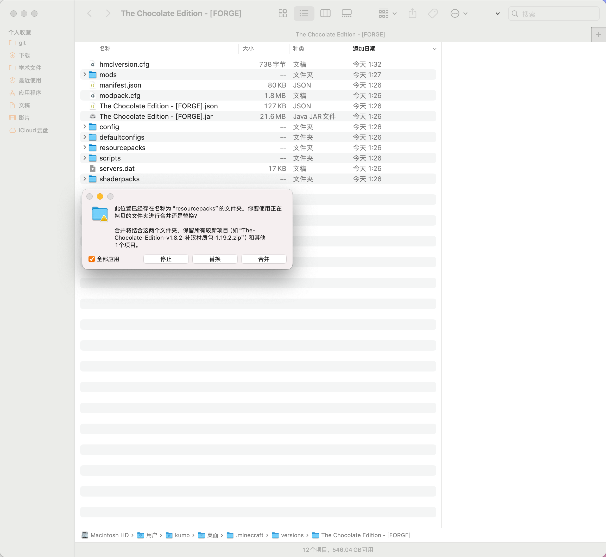
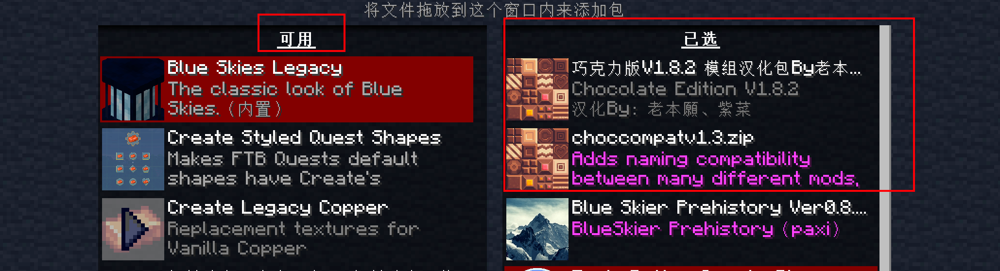
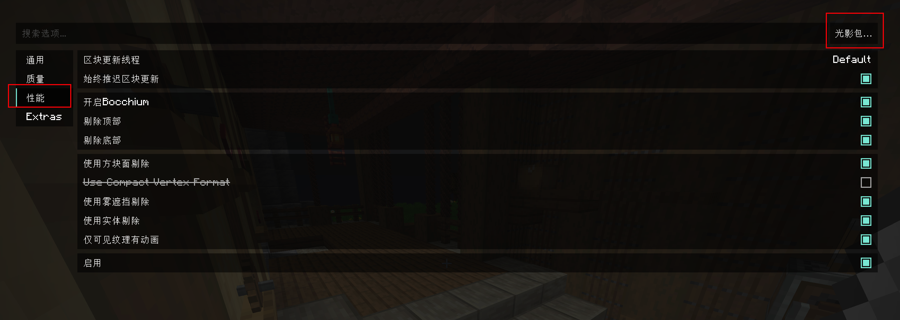
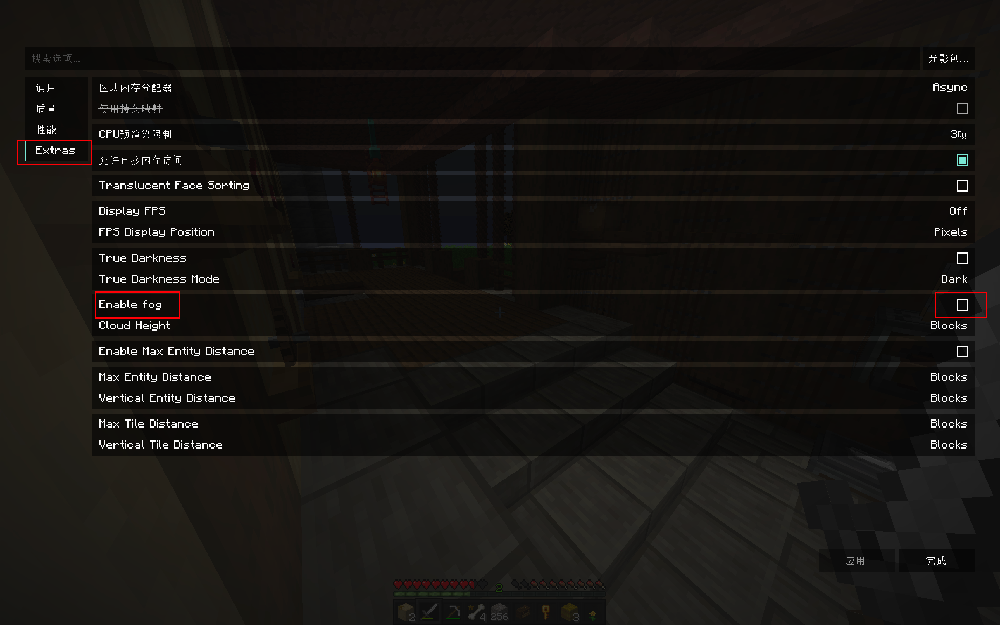

# The Chocolate Edition 寒假特辑

> 各位浙邦游戏群的xnn、邦bot开发群的开发者们, 寒假快乐! 
> 我特意为大家精选到了此整合包,为了让大家都能玩到,本篇文章我将提供一些介绍,优化推荐,汉化教程, 希望大家能够喜欢!
> PS: 没有寒假的朋友也可以玩哦~

本次服务器由 ***BanGDream Bot 开发群*** 热情提供.


## 整合包介绍(原文)
这个模组包就像是如果《泰拉瑞亚》的开发者制作的《我的世界》，去除了繁琐，去除了那种开始生存世界后很快就放弃的冲动。

- 进程
  - 在这个注重进程的包中，你必须探索世界的每一个部分来推进！你总是朝着到达末地的目标做些什么。
    个包定制的特色。它逐渐解锁更多的背景故事、物品、任务、装备、机制、维度，以及（即将）NPC。
  - 这防止了像原版那样急于进入游戏后期，并鼓励你实际与游戏中未充分利用的机制互动。发现末影的久远秘密，并为一个废墟中的世界注入生命...
- 性能
  - 在大多数电脑上运行！甚至比没有着色器的普通性能模组还要好！利用LOD来最大化渲染距离，并在游戏的每一步中从Mojang的意大利面条代码中卸载死重。
- Boss战斗
  - 45+ Boss战斗，内置指南（加上数十个迷你Boss），其中大多数直接影响末影之眼的进程！此外，许多引入酷炫的能力，增加策略而不是仅仅提升属性。
- 游戏内指南书
  - 庞大而详尽的游戏内指南书，记录并通知末影进程，指导玩家完成任务、目标和机制。还显示完整的制作树，带有分类和标签，这样你就不会迷失或不得不搜索东西，还有许多其他的生活质量改进。
- 世界生成
  - 探索每个生物群系中令人叹为观止且多样的世界生成，为每个生物群系的体验量身定制，使用内置地图自动记录你的探索，并找到生成的传送石作为固定的快速旅行点，减少这些巨大生态系统之间的旅行时间！
- 结构
  - 通过数十个巨大的、令人惊叹的结构，拥有定制平衡、独特战利品，需要不同的策略，每次都感觉新鲜！
- 战斗
  - 比原版多样化和独特数十倍的增强战斗，拥有定制动画、有趣的移动选项，以及拥有数百种不同效果/装备/能力的强大敌人，都带来独特的挑战！
- 生物
  - 发现并与数百种宠物、坐骑和怪物互动，它们在生物群系之间差异极大，提供广泛的奖励和机制！
- 建造
  - 用数千种简单而多变的方块建造，创建像火车这样的机器，磨练你的战斗技能，培养基础设施，征服这个奇幻领域！
- 还有更多...
  - 超越这个现实范围的背景故事...


## 安装与汉化
我已经为大家准备好了相关资源在群文件.

1.将整合包(群文件下载)拖入HMCL启动器,安装



> achocmusic如果下载速度过慢可以先取消安装,这时会显示整合包安装成功,但第一次启动时会自动下载achocmusic,这时可以挂加速节点加速.

2.点击hmcl主页的版本管理



打开游戏文件夹



3.这个时候会弹出游戏文件夹目录, 解压在群里下载的 `汉化.zip` 里面会出现如下2个文件夹 



4.把这2个文件夹 `复制` `粘贴` `合并` 到刚刚打开的游戏文件夹里   
(Windows10、Windows11用户应该直接粘贴就好)



5.然后启动游戏 可以先点击左侧`小地球`调简体中文    
然后点击 选项-资源包，在可用中找到汉化包,将补充汉化材质包放至原材质包 `上方` 完成汉化



### 至此全部汉化结束!

```PS:ftb任务汉化在服务端安装了,本教程不包含,需要私聊kumo```


## 游戏舒适度优化(建议看)

### 光影在哪关


### 为什么晚上黑的一塌糊涂,如何解决?

这是由于 `镁铷附属` 模组自带的毫无作用的 `真实黑暗` 特性导致的,关掉即可:


### 能不能一直像白天一样亮?
> 群文件下载 `tweakeroo.zip` 解压后,安装两个 `jar` 包插件
> 
这是著名的 `tweakeroo` 模组的forge版本 `Tweakerge-0.1.5-mc1.19.2`   
安装好进入游戏按下 `x` + `c` 快捷键, 输入 `gamma` 即可找到亮度调节(gamma覆写).


### 我是正版用户 如何看到自己/其他正版用户的皮肤?

> 群文件下载 `[万用皮肤补丁] CustomSkinLoader_ForgeV2-14.21.2.jar` 安装即可

### 如何拼音搜索

> 群文件下载 `jecharacters-1.19.2-4.4.2.jar` 安装即可

### 我不喜欢 `旅行地图` 这个小地图,如何更换?

自行下载喜欢的小地图模组,安装后禁用 `旅行地图` 即可(有三个需要禁用的jar包)    
推荐: `XaerosWorldMap_1.39.2_Forge_1.19.1` + `Xaeros_Minimap_24.7.1_Forge_1.19.1`


## 服务器地址

本次服务器由 ***BanGDream Bot 开发群*** 热情提供.   
为了避免外泄, 服务器会放在群精华里, 请自行查看.   
本服务器参与群聊仅为 ***浙邦游戏群*** 与 ***BanGDreamBot开发群*** .   
感谢你的喜欢!   

---

希望大家享受~
end.


---


